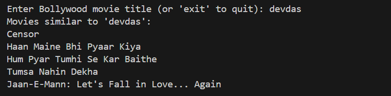

**Bollywood Movie Recommender**

A simple content-based movie recommendation system for Bollywood movies based on genre similarity.

**Description**

This Python project recommends Bollywood movies similar to a given movie title by analyzing the genres of movies using cosine similarity. It uses scikit-learn's CountVectorizer and cosine_similarity to find movies with overlapping genres.

**Features:**

Reads Bollywood movie details from a CSV file

Processes the genre column to create a feature matrix

Recommends top 5 similar movies based on genre similarity

Simple command-line interface to enter movie titles and get recommendations

**How to Use**

1. Clone the repository

2. Place BollywoodMovieDetail.csv in the same folder as main.py

3. Run the program: python main.py
4. Enter a Bollywood movie title when prompted
5. See the list of similar movies recommended

Dataset

The project uses the Bollywood Movie Detail dataset containing movie titles, release years, genres, directors, actors, and more.

https://www.kaggle.com/datasets/mitesh58/bollywood-movie-dataset

Technologies Used

Python 3.x

pandas

scikit-learn

**Outputs**

**Limitations and Future Work**

Recommendations are based solely on genre similarity

Does not incorporate user ratings or preferences

Future enhancements can include combining actors and directors data, collaborative filtering, and improved preprocessing

Feel free to customize this with your repo name, dataset link, or any screenshots.